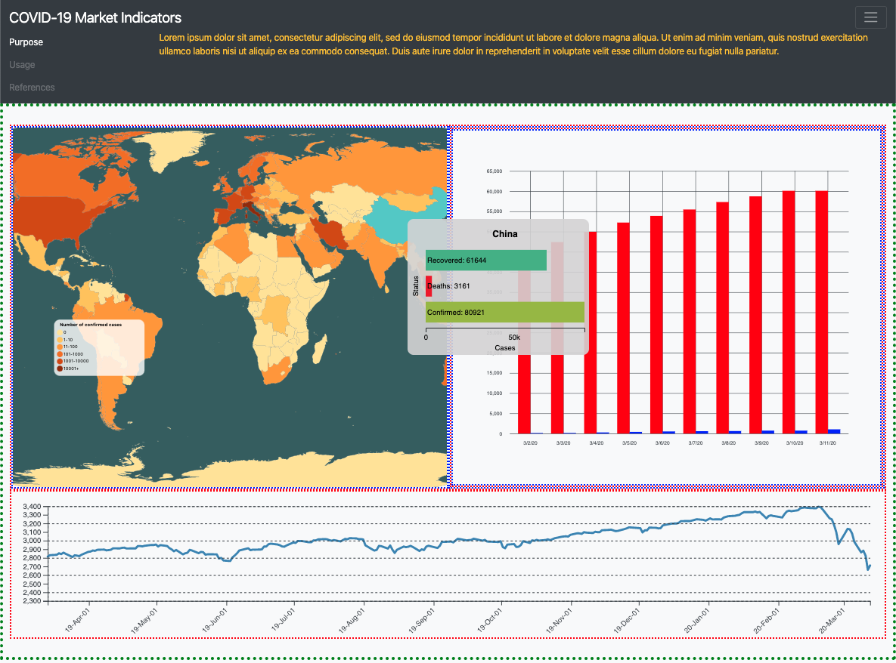

# project_covid19-stocks

## Writeup

As described in our project proposal, visualization goals remain the same.  They are to allow users to:

- Track and compare the rise and fall of stock prices on a daily basis
- Explore a dataset to identify global trends of COVID-19
- Find correlations between the spread of the virus and stock market activity.

To facilitate our first task, we chose to use a line chart with stock prices plotted vertically vs. date horizontally.  This is an immediately familiar way that people typically use to visualize stock market changes.

Our second task is addressed primarily with our choropleth map and our bar chart: users are able to identify which countries have the most and least number of confirmed cases as of COVID-19 so far, and more detailed breakdowns of cases (including deaths and recovered cases) are made visible upon hovering over a country via a horizontal bar chart in a tooltip.  The main bar chart to the right displays COVID-19 cases over time, and will eventually support the selection of up to 4 different countries to visualize at once, as well as the ability to switch between confirmed, deaths, and recovered cases to compare those global trends.

Our third task will be facilitated through interaction with the stocks line chart.  A user will be able to select a date range by clicking and dragging their cursor over a region of the stock chart, and that data will be reflected in both the map and our bar chart: only cases reported within the date range selected on the stock plot will be shown on the above two visualizations.

We are currently utilizing three datasets:

1. [Novel Corona Virus 2019 Dataset](https://www.kaggle.com/sudalairajkumar/novel-corona-virus-2019-dataset) - Data on COVID-19 taken from the World Health Organization, split into a number of different CSV files:
   1. A primary dataset containing serial number, observation date and last update (ordinal, Jan 22, 2020 to Mar 11, 2020), Province/state (categorical, ~300 regions), Country/Region (categorical, ~200 countries), Confirmed, Deaths, and Recovered (quantitative, 0 to ~100,000)
   2. Three time different time series files for confirmed, deaths, and recovered cases derived from the main dataset containing Province/State (categorical, ~300 regions), Country/Region (categorical, ~200 countries), Latitude (quantitative, -41.5 to 72), Longitude (quantitative, -158 to 178), and number of cases on a given date from Jan 22, 2020 to Mar 11, 2020 (quantitative, 0 to 22,000 for confirmed cases, 0 to ~700 for deaths, 0 to ~800 for recovered cases)
2. [World Atlas TopoJSON](https://github.com/topojson/world-atlas) - TopoJSON data used to render our choropleth map
3. [Yahoo! Finance: S&P 500 historical data](https://finance.yahoo.com/quote/%5EGSPC/history/) consisting of Date (ordinal, Mar 14, 2019 to Mar 13, 2020), Opening, High, Low, Close, Adjusted Close amounts (quantitative, ~2000 to 3500), and Volume (~3 to 9 trillion)

We may utilize more datasets in the future, specifically more stock data beyond the S&P 500.

We have strived to keep our data processing pipeline simple and separate from our visualization.  When each of our visualizations are constructed, we process different datasets for each visualization separately through the use of a separate constructor for each visualization.  Notably, the datasets used for COVID-19 data and for the topojson use different names for each country.  For example, "China" in the topojson is "Mainland China" in the COVID-19 data and "United States of America" in the topojson is "US" in the COVID-19 data.  To resolve this problem, we created a dictionary found in `js/map/map_dict` that maps country names between the two datasets.  For the choropleth map, we additionally group the numbers for each country on a given day by using `d3.nest()` and `.rollup()` to allow for accurate case counts.  Similarly, for the bar chart, we first clean our data and then group numbers by country instead of Province/State.  We had discussed the possibility of utilizing `crossfilter` but ultimately decided against it, as it would add complexity to the project that would not significantly enhance our visualization to meet our goals.

## Project Management & Team Assessment

### Status Update

| Task Description                                             | Date Completed | Estimated time          | Actual time             |
| ------------------------------------------------------------ | -------------- | ----------------------- | ----------------------- |
| Draft proposal and revision                                  | 07/03/20       | 6 hours per team member | 6 hours per team member |
| Initial scaffolding of project                               | 13/03/20       | 2 hours                 | 2 hours                 |
| Choropleth map: data cleaning                                | 15/03/20       | 2 hours                 | 2 hours                 |
| Choropleth map: initial rendering w/ colour legend           | 18/03/20       | 8 hours                 | 8 hours                 |
| Choropleth map: enhanced interaction for charts embedded in tooltips | 22/03/20       | 8 hours                 | 8 hours                 |
| Bar chart: data cleaning                                     | 18/03/20       | 4 hours                 | 5 hours                 |
| Bar chart: initial rendering                                 | 18/03/20       | 4 hours                 | 5 hours                 |
| Line chart: data cleaning                                    | 21/03/20       | 4 hours                 | 1 hour                  |
| Line chart: initial rendering                                | 21/03/20       | 4 hours                 | 4 hours                 |
| UI: arrange charts responsively                              | 23/03/20       | Was not planned         | 4 hours                 |
| Milestone 2 meeting                                          | 23/03/20       | 1 hour per team member  | 1 hour per team member  |
| Milestone 2 Writeup                                          | 25/03/20       | 2 hours per team member | 2 hours per team member |
| TODO Bar chart: interactivity with radio buttons (select between "confirmed", "deaths", and "recovered") | 05/04/20       | 4 hours                 |                         |
| TODO Bar chart + map: bidirectional interactivity.  Allow users to select up to 4 countries to show bar chart data for, either by clicking on countries on the map or by selecting countries from dropdown menus below the bar chart | 05/04/20       | 6 hours                 |                         |
| TODO Line chart: interactivity.  Allow users to click and drag a region of dates on the line chart, and have those changes reflected in both the bar chart and the map | 05/04/20       | 8 hours                 |                         |
| TODO Milestone 3 meeting                                | 06/04/20       | 1 hour per team member  |                         |
| TODO Milestone 3 writeup                                | 07/04/20       | 2 hours per team member |                         |
| TODO Project demo                                       | TBD            | TBD                     |                         |

### Contributions Breakdown

- Jordan: Set up initial scaffolding of project, choropleth map implementation, m2 writeup draft
- Brian: Helped design initial scaffolding of project, (implemented by Jordan), S&P 500 line chart implementation, some m2 writeup contribution and code cleanup, responsive UI refactor with Bootstrap 4.
- TODO Alan:

### Team Process

|                                                              | Weak | Satisfactory | Good | Excellent | What are specific actions you want to take to address the issues, if there are any? |
| ------------------------------------------------------------ | ---- | ------------ | ---- | --------- | ------------------------------------------------------------ |
| Team has a clear vision of the problem(s)                    |      |              | X    |           |                                                              |
| Team is properly organized to complete task and cooperates well |      |              | X    |           |                                                              |
| Team managed time wisely                                     |      |              | X    |           |                                                              |
| Team acquired needed knowledge base                          |      |              |      | X         |                                                              |
| Efforts communicated well within group                       |      |              | X    |           |                                                              |

